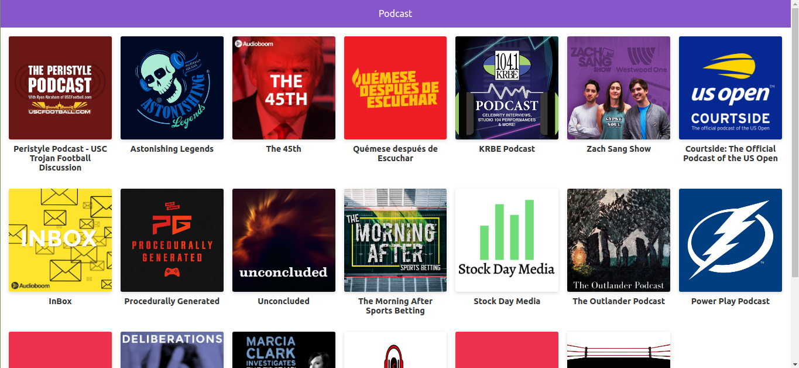

# App de Podcast realizada en el curso de Next.js de Platzi

App de Podcast integrada con la API de AudioBoom para aprender Next.js

## ¿Cómo funciona?

Requiere Node.js

* `npm install` para insstalar las dependencias.
* `npm run dev` para el entorno de desarrollo.
* `npm run buid && npm start` para el entorno de producción.

## Licencia

MIT